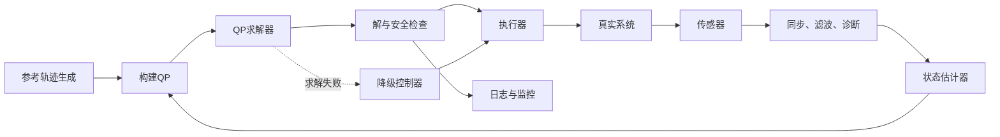

+++
title = "[MPC] 从代价函数到滚动优化与工程落地"
date = 2026-08-30T13:00:00+08:00
draft = false
article_status = "permanent"
applicable_versions = ["all"]
comments = true
tags = ["控制", "机器人"]
+++

## 写在前面

在上一篇中，我们已经从离散系统模型出发，将未来 $N$ 步的状态和输入堆叠起来，并且推得了代价函数 $J$ 的通用计算公式。

但仅仅会计算 $J$ 还不等于完成了MPC：$J$ 只是一个“评分器”，它只能告诉我们某一组控制序列好不好；MPC还需要在所有可行的控制序列中找到评分最低的一组，然后只执行其中的第一个控制量，并在下一时刻重新求解。

本文从已经推得的代价函数开始，继续补全三个问题：

1. 如何从 $J$ 得到最优控制序列；
2. “滚动优化”究竟体现在哪里；
3. 一套真正运行在工程系统中的MPC由哪些模块组成。

> 本文讨论离散、线性、时不变系统上的线性MPC；非线性MPC的整体框架相似，但预测模型和优化问题通常不再是标准二次规划。

## 符号整理

首先，定义离散系统：

$$
x(k+1)=Ax(k)+Bu(k)
$$

$$
y(k)=C_yx(k)+Du(k)
$$

其中：

* $x\in\mathbb{R}^n$ 是系统状态；
* $u\in\mathbb{R}^p$ 是控制器输出，同时也是被控系统的输入；
* $y\in\mathbb{R}^m$ 是被控系统的输出；
* $A,B,C_y,D$ 是离散系统矩阵。

> 注意：控制器的输出是 $u$，被控系统的输出是 $y$，两者不能混为一谈。

为了避免系统输出矩阵 $C_y$ 和上一篇中的预测矩阵 $C$ 重名，本文将预测方程重新记作：

$$
X_k=\Phi x_k+\Gamma U_k \tag{1}
$$

它和上一篇的记号完全对应：

$$
\Phi=M,\qquad \Gamma=C
$$

其中：

$$
X_k=
\begin{bmatrix}
x(k|k)\\
x(k+1|k)\\
\vdots\\
x(k+N|k)
\end{bmatrix}
$$

$$
U_k=
\begin{bmatrix}
u(k|k)\\
u(k+1|k)\\
\vdots\\
u(k+N-1|k)
\end{bmatrix}
$$

## 从代价函数开始

### 一般参考轨迹

如果系统需要跟踪参考轨迹，而不仅仅是稳定到原点，则应将未来参考值也堆叠起来：

$$
X_{\mathrm{ref},k}=
\begin{bmatrix}
x_{\mathrm{ref}}(k|k)\\
x_{\mathrm{ref}}(k+1|k)\\
\vdots\\
x_{\mathrm{ref}}(k+N|k)
\end{bmatrix}
$$

定义代价函数：

$$
J=
(X_k-X_{\mathrm{ref},k})^T\bar Q(X_k-X_{\mathrm{ref},k})
+U_k^T\bar R U_k \tag{2}
$$

其中，通常要求：

$$
\bar Q=\bar Q^T\succeq0,\qquad
\bar R=\bar R^T\succ0
$$

将式$(1)$代入式$(2)$：

$$
J=
(\Phi x_k+\Gamma U_k-X_{\mathrm{ref},k})^T
\bar Q
(\Phi x_k+\Gamma U_k-X_{\mathrm{ref},k})
+U_k^T\bar R U_k
$$

将所有项展开：

$$
\begin{aligned}
J={}&U_k^T(\Gamma^T\bar Q\Gamma+\bar R)U_k\\
&+2(\Phi x_k-X_{\mathrm{ref},k})^T\bar Q\Gamma U_k\\
&+(\Phi x_k-X_{\mathrm{ref},k})^T
\bar Q
(\Phi x_k-X_{\mathrm{ref},k})
\end{aligned}
$$

令：

$$
H=\Gamma^T\bar Q\Gamma+\bar R \tag{3}
$$

$$
g_k=\Gamma^T\bar Q(\Phi x_k-X_{\mathrm{ref},k}) \tag{4}
$$

$$
c_k=(\Phi x_k-X_{\mathrm{ref},k})^T
\bar Q
(\Phi x_k-X_{\mathrm{ref},k}) \tag{5}
$$

则代价函数可以写成：

$$
J(U_k)=U_k^THU_k+2g_k^TU_k+c_k \tag{6}
$$

在时刻 $k$，$x_k$ 和 $X_{\mathrm{ref},k}$ 都是已知量，所以 $c_k$ 是与 $U_k$ 无关的常数。它会改变 $J$ 的数值，却不会改变使 $J$ 最小的 $U_k$。

因此，优化时可以只保留：

$$
\min_{U_k}\quad U_k^THU_k+2g_k^TU_k \tag{7}
$$

> 到这里，我们才从“计算一组控制序列的代价”进入“寻找代价最小的控制序列”。

## 无约束优化

先考虑没有输入和状态约束的情况。

对式$(6)$关于 $U_k$ 求导：

$$
\frac{\partial J}{\partial U_k}=2HU_k+2g_k
$$

令导数为零：

$$
2HU_k^*+2g_k=0
$$

如果 $H$ 正定，则最优控制序列唯一，并且：

$$
U_k^*=-H^{-1}g_k \tag{8}
$$

代入 $g_k$ 的定义：

$$
U_k^*=
-H^{-1}\Gamma^T\bar Q
(\Phi x_k-X_{\mathrm{ref},k}) \tag{9}
$$

式$(9)$同时算出了未来 $N$ 步的全部控制输入：

$$
U_k^*=
\begin{bmatrix}
u^*(k|k)\\
u^*(k+1|k)\\
\vdots\\
u^*(k+N-1|k)
\end{bmatrix}
$$

> 工程实现中通常不直接计算 $H^{-1}$，而是求解线性方程 $HU_k^*=-g_k$，这样在数值上更加稳定。

## 关于“候选控制序列”和“优化”的进一步说明

看到式$(8)$后，很容易产生三个疑问：候选控制序列从哪里来？优化器如何调整 $U_k$？既然求偏导可以直接得到 $U_k^*$，为什么还需要优化？

### 候选控制序列从哪里来

“候选控制序列”不是系统提前提供的一组数据，也不是控制器先生成一张有限的候选列表，再逐项计算代价。

在建立MPC问题时，我们直接把未来 $N$ 步控制输入定义为决策变量：

$$
U_k=
\begin{bmatrix}
u(k|k)\\
u(k+1|k)\\
\vdots\\
u(k+N-1|k)
\end{bmatrix}
\in\mathbb R^{Np}
$$

如果暂时不考虑约束，那么 $\mathbb R^{Np}$ 中的每一个点都代表一组可能的未来控制序列。

加入约束后，所有满足约束的控制序列构成可行集合：

$$
\mathcal U_k=
\left\{
U_k\mid A_{\mathrm{ineq}}U_k\le b_{\mathrm{ineq},k}
\right\}
$$

所谓“候选控制序列”，实际上只是指任意一个：

$$
U_k\in\mathcal U_k
$$

优化器的任务可以准确地写成：

$$
U_k^*=\arg\min_{U_k\in\mathcal U_k}J(U_k)
$$

因此，候选序列并不是某个额外模块产生的；它来自我们为决策变量 $U_k$ 定义的取值空间和约束集合。

### 优化器如何调整 $U_k$

数值求解器通常需要一个初始迭代点，例如：

$$
U_k^{(0)}=
\begin{bmatrix}
0&0&\cdots&0
\end{bmatrix}^T
$$

也可以使用上一时刻最优序列平移后的结果作为初值，这就是warm start。

对于代价函数：

$$
J(U_k)=U_k^THU_k+2g_k^TU_k+c_k
$$

其梯度为：

$$
\nabla J(U_k)=2HU_k+2g_k
$$

梯度指向 $J$ 增大最快的方向，因此负梯度指向局部下降方向。最简单的梯度下降更新为：

$$
U_k^{(j+1)}=
U_k^{(j)}-\alpha\left(2HU_k^{(j)}+2g_k\right)
$$

其中：

* $j$ 是求解器内部的迭代次数；
* $\alpha>0$ 是迭代步长；
* $U_k^{(j)}$ 是第 $j$ 次迭代得到的控制序列。

如果存在约束，直接进行梯度更新可能使 $U_k$ 离开可行域。一个容易理解的处理方法，是在更新后把结果投影回可行集合：

$$
U_k^{(j+1)}=
\Pi_{\mathcal U_k}
\left[
U_k^{(j)}-\alpha\nabla J(U_k^{(j)})
\right]
$$

其中，$\Pi_{\mathcal U_k}$ 表示将一个点映射到可行集合中距离它最近的位置。

实际QP求解器不一定使用普通梯度下降，而可能采用active-set、interior-point或ADMM等方法。MPC负责建立 $H,g_k$ 和约束；至于如何移动迭代点并找到最优解，是QP求解器内部的工作。

> “优化器调整 $U_k$”是一种帮助理解的说法，并不意味着所有求解器都会显式枚举许多控制序列。

### 已经可以直接求出 $U_k^*$，为什么还需要优化

对于本文当前讨论的无约束线性二次问题，确实不需要在线反复试探。

令梯度为零：

$$
2HU_k^*+2g_k=0
$$

便可以直接得到：

$$
U_k^*=-H^{-1}g_k
$$

这并不代表“没有优化”，而是说明这个优化问题存在解析解。求导、令梯度为零并解出极小值，本身就是解析地完成了一次优化。

对于线性时不变系统，如果参考值为零，则通常可以进一步写成：

$$
U_k^*=-K_{\mathrm{MPC}}x_k
$$

其中：

$$
K_{\mathrm{MPC}}
=H^{-1}\Gamma^T\bar Q\Phi
$$

由于 $K_{\mathrm{MPC}}$ 可以离线计算，在线阶段只需要进行矩阵乘法。从这个角度看，无约束线性二次MPC和有限时域LQR非常接近。

真正使MPC通常需要在线QP求解器的，是约束条件。

例如，考虑代价函数：

$$
J(u)=(u-5)^2
$$

无约束情况下：

$$
\frac{dJ}{du}=2(u-5)=0
$$

因此解析最优解为：

$$
u^*=5
$$

但是，如果执行器只能满足：

$$
0\le u\le2
$$

那么 $u=5$ 不在可行域内。此时真正的问题是：

$$
\begin{aligned}
\min_u\quad &(u-5)^2\\
\mathrm{s.t.}\quad&0\le u\le2
\end{aligned}
$$

受约束最优解位于约束边界：

$$
u^*=2
$$

这说明 $-H^{-1}g_k$ 只能给出无约束二次函数的最低点。如果该点违反输入、状态或安全约束，就必须在可行域内重新寻找最低点。

因此，可以做出如下区分：

$$
\begin{array}{ll}
\text{无约束线性二次问题}
&\Rightarrow \text{可以直接求解析解}\\[2mm]
\text{有约束线性二次问题}
&\Rightarrow \text{通常在线求解QP}\\[2mm]
\text{非线性模型或非二次代价}
&\Rightarrow \text{通常求解非线性优化问题}
\end{array}
$$

> 无约束情况下，优化被解析公式一次完成；有约束情况下，解析最低点可能不可执行，QP求解器才需要在可行域中寻找真正的最优控制序列。

## 有约束优化

无约束最优解可能要求电机输出无限大的转矩、车辆产生无法实现的加速度，或者让系统状态越过安全边界。MPC的重要价值之一，就是可以把这些限制直接写进优化问题。

### 输入约束

假设每一步的控制输入都满足：

$$
u_{\min}\le u(k+i|k)\le u_{\max}
$$

堆叠后有：

$$
U_{\min}\le U_k\le U_{\max} \tag{10}
$$

也就是：

$$
\begin{bmatrix}
I\\-I
\end{bmatrix}U_k
\le
\begin{bmatrix}
U_{\max}\\-U_{\min}
\end{bmatrix}
$$

### 状态约束

假设预测状态需要满足：

$$
X_{\min}\le X_k\le X_{\max}
$$

将 $X_k=\Phi x_k+\Gamma U_k$ 代入：

$$
\Gamma U_k\le X_{\max}-\Phi x_k
$$

$$
-\Gamma U_k\le -X_{\min}+\Phi x_k
$$

> 本文的 $X_k$ 包含当前状态 $x(k|k)$。由于当前状态已经发生，控制器无法再改变它，所以工程上通常只对 $x(k+1|k)$ 到 $x(k+N|k)$ 施加预测状态约束；否则当前状态一旦越界，优化问题可能立即变成不可行。

### 输入变化率约束

实际执行器往往不仅限制输入大小，还限制输入变化速度。例如，转矩不能在一个采样周期内从最小值直接跳到最大值。

定义：

$$
\Delta u(k|k)=u(k|k)-u(k-1)
$$

$$
\Delta u(k+i|k)=u(k+i|k)-u(k+i-1|k)
$$

将所有输入变化堆叠起来：

$$
\Delta U_k=D_\Delta U_k-d_k
$$

其中：

$$
D_\Delta=
\begin{bmatrix}
I&0&0&\cdots&0\\
-I&I&0&\cdots&0\\
0&-I&I&\cdots&0\\
\vdots&\vdots&\ddots&\ddots&\vdots\\
0&0&\cdots&-I&I
\end{bmatrix}
$$

$$
d_k=
\begin{bmatrix}
u(k-1)\\0\\\vdots\\0
\end{bmatrix}
$$

因此，变化率约束：

$$
\Delta U_{\min}\le\Delta U_k\le\Delta U_{\max}
$$

可以写成：

$$
D_\Delta U_k\le\Delta U_{\max}+d_k
$$

$$
-D_\Delta U_k\le-\Delta U_{\min}-d_k
$$

### 整理成标准二次规划

许多QP求解器采用下面的标准形式：

$$
\begin{aligned}
\min_{U_k}\quad &\frac12U_k^TPU_k+q_k^TU_k\\
\mathrm{s.t.}\quad&A_{\mathrm{ineq}}U_k\le b_{\mathrm{ineq},k}
\end{aligned} \tag{11}
$$

根据式$(7)$，有：

$$
P=2H
$$

$$
q_k=2g_k
$$

只考虑输入约束和状态约束时：

$$
A_{\mathrm{ineq}}=
\begin{bmatrix}
I\\
-I\\
\Gamma\\
-\Gamma
\end{bmatrix}
$$

$$
b_{\mathrm{ineq},k}=
\begin{bmatrix}
U_{\max}\\
-U_{\min}\\
X_{\max}-\Phi x_k\\
-X_{\min}+\Phi x_k
\end{bmatrix}
$$

输入变化率约束可以继续堆叠到 $A_{\mathrm{ineq}}$ 和 $b_{\mathrm{ineq},k}$ 的底部。

最终，QP求解器返回：

$$
U_k^*=\arg\min_{U_k}J(x_k,U_k) \tag{12}
$$

> $\min J$ 表示最小代价值；$\arg\min J$ 表示取得最小代价时的决策变量。控制器真正需要的是 $\arg\min$ 得到的 $U_k^*$。

## 预测区间内的状态和输出从哪里来

在优化开始前，我们并不知道未来真实状态，也不知道最优控制序列。优化器处理的是下面的对应关系：

$$
\text{一组候选 }U_k
\Longrightarrow
X_k=\Phi x_k+\Gamma U_k
\Longrightarrow
J(x_k,U_k)
$$

也就是说，每确定一组候选 $U_k$，系统模型就唯一确定一组预测状态 $X_k$；优化器不断调整 $U_k$，直到找到满足约束且代价最低的控制序列。

求得 $U_k^*$ 后，其对应的最优预测状态为：

$$
X_k^*=\Phi x_k+\Gamma U_k^* \tag{13}
$$

如果 $y=x$，则：

$$
Y_k^*=X_k^*
$$

对于一般输出方程 $y=C_yx+Du$，先将具有对应输入的前 $N$ 个预测输出堆叠起来：

$$
Y_k=
\begin{bmatrix}
y(k|k)\\
y(k+1|k)\\
\vdots\\
y(k+N-1|k)
\end{bmatrix}
$$

再定义 $S_x$ 为从 $X_k$ 中选取前 $N$ 个状态的选择矩阵：

$$
S_xX_k=
\begin{bmatrix}
x(k|k)\\
x(k+1|k)\\
\vdots\\
x(k+N-1|k)
\end{bmatrix}
$$

于是：

$$
Y_k=(I_N\otimes C_y)S_xX_k+(I_N\otimes D)U_k
$$

为了缩短公式，令：

$$
\mathcal C=(I_N\otimes C_y)S_x,
\qquad
\mathcal D=I_N\otimes D
$$

便得到：

$$
Y_k=\mathcal C X_k+\mathcal D U_k
$$

继续代入预测状态方程：

$$
Y_k=\mathcal C\Phi x_k+(\mathcal C\Gamma+\mathcal D)U_k \tag{14}
$$

因此：

$$
Y_k^*=\mathcal C\Phi x_k+(\mathcal C\Gamma+\mathcal D)U_k^*
$$

> 这些是基于当前状态、模型和最优控制序列得到的“预测输出”，不是提前知道的真实未来输出。模型误差、扰动和测量噪声都会让真实输出与预测输出产生偏差。

## 滚动优化

### 为什么只执行第一个控制量

虽然QP求解器一次得到了未来 $N$ 步的最优控制序列，但MPC只执行其中第一项。

定义控制选择矩阵：

$$
K_u=
\begin{bmatrix}
I_p&0&\cdots&0
\end{bmatrix}
$$

则当前真正发送给执行器的控制量为：

$$
u(k)=K_uU_k^*=u^*(k|k) \tag{15}
$$

系统运行一个采样周期后，真实系统产生：

$$
x(k+1)=Ax(k)+Bu(k)+w(k)
$$

其中 $w(k)$ 表示未建模动态和外部扰动。

控制器在 $k+1$ 时刻重新测量或估计状态：

$$
\hat x_{k+1}=x(k+1)+\text{估计误差}
$$

然后舍弃原计划中的剩余部分，重新求解：

$$
\begin{aligned}
U_{k+1}^*
&= \arg\min_{U_{k+1}} J(\hat x_{k+1},U_{k+1})
\end{aligned} \tag{16}
$$

再执行新序列中的第一项：

$$
u(k+1)=K_uU_{k+1}^*
$$

于是形成循环：

$$
\boxed{
\text{测量/估计}
\rightarrow
\text{预测}
\rightarrow
\text{优化}
\rightarrow
\text{执行第一项}
\rightarrow
\text{重新测量}
}
$$

这里的“滚动”是预测窗口从 $[k,k+N]$ 移动到 $[k+1,k+N+1]$；这里的“优化”是每一个采样时刻都重新计算一次 $\arg\min J$。

## 一个简单的数值例子

假设存在标量系统：

$$
x(k+1)=x(k)+u(k),\qquad y(k)=x(k)
$$

当前状态为：

$$
x_k=0
$$

参考值为：

$$
r=3
$$

令预测区间 $N=2$，则：

$$
U_k=
\begin{bmatrix}
u_0\\u_1
\end{bmatrix}
$$

预测状态为：

$$
x_{1|k}=u_0
$$

$$
x_{2|k}=u_0+u_1
$$

定义代价函数：

$$
J=(x_{1|k}-3)^2+(x_{2|k}-3)^2+u_0^2+u_1^2
$$

代入预测状态：

$$
J=(u_0-3)^2+(u_0+u_1-3)^2+u_0^2+u_1^2
$$

展开：

$$
J=3u_0^2+2u_0u_1+2u_1^2-12u_0-6u_1+18
$$

对 $u_0,u_1$ 分别求导并令其为零：

$$
6u_0+2u_1-12=0
$$

$$
2u_0+4u_1-6=0
$$

解得：

$$
U_k^*=
\begin{bmatrix}
1.8\\0.6
\end{bmatrix}
$$

预测状态为：

$$
X_k^*=
\begin{bmatrix}
0\\1.8\\2.4
\end{bmatrix}
$$

但是控制器只执行：

$$
u(k)=1.8
$$

如果下一时刻测得的真实状态不是预测的 $1.8$，而是 $1.7$，那么控制器不会直接执行原计划中的 $0.6$，而是从 $x_{k+1}=1.7$ 出发重新求解一个新的两步优化问题。

这就是滚动优化修正模型误差和外部扰动的方式。

## 工程落地 Pipeline

一套真正运行的MPC通常分为“离线准备”和“在线闭环”两部分。

### 离线准备

#### 1. 建立和验证模型

首先获得连续或离散系统模型：

$$
\dot x=A_cx+B_cu
$$

如果模型是连续的，需要根据采样周期 $T_s$ 离散化。零阶保持下：

$$
A=e^{A_cT_s}
$$

$$
B=\int_0^{T_s}e^{A_c\tau}B_c\,d\tau
$$

也可以通过增广矩阵指数一次求得 $A$ 和 $B$：

$$
\begin{aligned}
\exp\left(
\begin{bmatrix}
A_c & B_c \\
0 & 0
\end{bmatrix}T_s
\right)
&=
\begin{bmatrix}
A & B \\
0 & I
\end{bmatrix}
\end{aligned}
$$

模型建立后，需要检查它在工作区间内是否足够准确，并检查可控性和可观性。

#### 2. 确定采样周期和预测区间

采样周期为 $T_s$，预测步数为 $N$，二者决定实际预测时长：

$$
T_{\mathrm{prediction}}=NT_s
$$

预测区间过短，控制器可能只顾眼前；预测区间过长，则优化变量增多、计算量增大，而且远期预测更依赖模型精度。

#### 3. 设置代价权重

一般需要设置：

* 状态或输出误差权重 $Q$；
* 输入幅值权重 $R$；
* 输入变化率权重 $S$；
* 终端权重 $F$。

例如加入输入变化率惩罚后：

$$
J=
(X_k-X_{\mathrm{ref},k})^T\bar Q(X_k-X_{\mathrm{ref},k})
+U_k^T\bar R U_k
+\Delta U_k^T\bar S\Delta U_k
$$

不同量的单位可能相差很大，因此工程上通常先进行尺度归一化，再调整权重。

#### 4. 设置硬约束和软约束

硬约束绝对不能违反，例如物理输入极限；软约束允许在紧急情况下小幅违反，以避免优化问题无解。

例如给状态上界加入松弛变量 $\epsilon\ge0$：

$$
X_k\le X_{\max}+\epsilon
$$

并在代价函数中惩罚它：

$$
J_{\mathrm{soft}}=J+\rho\epsilon^T\epsilon
$$

其中 $\rho$ 应足够大，使优化器只有在必要时才违反软约束。

#### 5. 预计算固定矩阵

对于线性时不变MPC，下列矩阵通常可以离线计算：

$$
\Phi,\quad\Gamma,\quad\bar Q,\quad\bar R,\quad P,
\quad A_{\mathrm{ineq}}
$$

在线阶段主要根据当前状态和参考轨迹更新：

$$
q_k,qquad b_{\mathrm{ineq},k}
$$

这样可以明显减少每个采样周期的计算量。

### 在线闭环

在线阶段每隔一个采样周期运行一次：

1. 读取传感器；
2. 对信号进行时间同步、滤波和异常值检查；
3. 使用观测器或Kalman Filter得到状态估计 $\hat x_k$；
4. 生成未来 $N$ 步参考轨迹 $X_{\mathrm{ref},k}$；
5. 根据 $\hat x_k$、参考轨迹和上一次输入构建 $q_k$、$b_{\mathrm{ineq},k}$；
6. 调用QP求解器得到 $U_k^*$；
7. 检查求解状态、约束和控制量是否有效；
8. 只发送 $U_k^*$ 的第一项；
9. 保存本次解，为下一个周期提供warm start；
10. 记录状态、参考值、预测轨迹、控制量、约束余量、求解时间和求解器状态。



### 最小在线伪代码

```text
离线：
    根据 A、B、N 构建 Phi、Gamma
    根据 Q、R、F 构建 Q_bar、R_bar
    P = 2 * (Gamma.T * Q_bar * Gamma + R_bar)
    构建固定约束矩阵 A_ineq

在线，每个采样周期 k：
    measurement = read_sensors()
    x_hat = state_estimator.update(measurement, u_previous)
    X_ref = reference_generator.preview(k, N)

    g = Gamma.T * Q_bar * (Phi * x_hat - X_ref)
    q = 2 * g
    b_ineq = build_constraint_bound(x_hat, u_previous)

    result = qp_solver.solve(P, q, A_ineq, b_ineq, warm_start)

    if result is valid and finished before deadline:
        U_star = result.solution
        u_command = first_block(U_star)
        warm_start = shift(U_star)
    else:
        u_command = fallback_controller(x_hat, reference)

    u_command = final_safety_check(u_command)
    actuator.write(u_command)
    u_previous = u_command
    logger.write(...)
```

其中，warm start通常将上一次最优序列向前平移一位：

$$
U_{k+1}^{\mathrm{warm}}=
\begin{bmatrix}
u^*(k+1|k)\\
u^*(k+2|k)\\
\vdots\\
u^*(k+N-1|k)\\
u^*(k+N-1|k)
\end{bmatrix}
$$

它只是求解器的初始猜测，不能代替 $k+1$ 时刻的重新优化。

## 工程实现中容易忽略的问题

### 求解超时

控制周期为 $T_s$ 时，需要满足：

$$
T_{\mathrm{estimate}}+T_{\mathrm{build}}+T_{\mathrm{solve}}+T_{\mathrm{check}} \lt T_s
$$

不能只关注平均求解时间，还应检查最坏情况下的求解时间。

### 优化问题无解

传感器异常、参考值突变或约束设置过紧，都可能让QP变得不可行。系统必须提前规定降级策略，例如：

* 使用上一次安全控制量；
* 切换到PID或LQR；
* 将部分状态约束软化；
* 进入安全停车或限功率模式。

### 状态无法直接测量

如果传感器只能测到 $y$，而MPC需要完整状态 $x$，则必须加入状态估计器，例如Luenberger Observer、Kalman Filter或扩展Kalman Filter。

MPC的闭环状态通常应写成：

$$
\hat x_k=\text{Estimator}(y_k,u_{k-1})
$$

$$
U_k^*=\arg\min_{U_k}J(\hat x_k,U_k)
$$

### 稳态偏差

模型误差或恒定扰动可能造成稳态偏差。常见解决方法包括：

* 在模型中加入扰动状态；
* 对误差引入积分状态；
* 使用offset-free MPC。

仅仅不断滚动优化，并不能自动保证不存在稳态偏差。

### 执行器延迟

如果从采样到控制量生效之间存在明显延迟，就需要把延迟加入预测模型，或者使用延迟补偿。否则控制器预测的“第一步”与真实系统接收到控制量的时刻并不一致。

### 模型工作区间

线性模型通常只在某个工作点附近准确。当状态远离线性化工作点时，可以考虑增益调度、线性时变MPC或非线性MPC。

## 从数学公式到工程模块的对应关系

| 数学对象 | 工程中的来源或模块 |
|---|---|
| $A,B,C_y,D$ | 物理建模、系统辨识和离散化 |
| $\hat x_k$ | 传感器与状态估计器 |
| $X_{\mathrm{ref},k}$ | 轨迹规划器或上层控制器 |
| $Q,R,F,S$ | 控制性能设计与标定 |
| $U_{\min},U_{\max}$ | 执行器物理极限 |
| $X_{\min},X_{\max}$ | 安全边界和任务约束 |
| $P,q_k,A_{\mathrm{ineq}},b_{\mathrm{ineq},k}$ | QP构建模块 |
| $U_k^*$ | QP求解器输出 |
| $K_uU_k^*$ | 当前真正发送给执行器的命令 |
| 下一次重新求解 | 滚动优化和反馈校正 |

## 总结

从代价函数到完整MPC，可以压缩成下面四个公式。

预测：

$$
X_k=\Phi x_k+\Gamma U_k
$$

优化：

$$
U_k^*=\arg\min_{U_k}J(x_k,U_k)
$$

执行：

$$
u(k)=K_uU_k^*
$$

滚动：

$$
U_{k+1}^*=\arg\min_{U_{k+1}}J(\hat x_{k+1},U_{k+1})
$$

其中，模型负责回答“给定控制序列后，未来可能怎样变化”；代价函数负责回答“这条未来轨迹好不好”；优化器负责回答“哪一组可行控制序列最好”；滚动执行则利用新的真实测量不断修正预测。

因此，MPC并不是单纯地向未来计算 $N$ 步，而是在每一个采样时刻都对未来 $N$ 步重新进行一次受约束优化。
