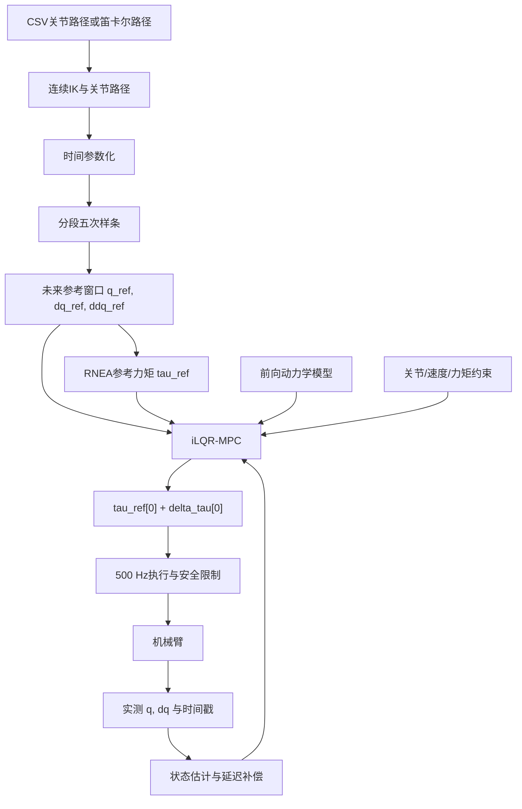

+++
title = "[控制] 逆动力学前馈与 iLQR-MPC 机械臂轨迹跟踪"
date = 2026-08-30T12:00:00+08:00
draft = true
article_status = "permanent"
applicable_versions = ["all"]
comments = true
columns = ["控制", "控制/轨迹跟踪"]
tags = []
+++

## 写在前面

本文面向工程实现，完整说明一套以关节力矩为控制量的机械臂动力学轨迹跟踪方案。我们的目标不是只在数学上写出一个 MPC 优化问题，而是建立一条能够落地的软件与控制链路：

```text
CSV 关节路径 / 笛卡尔路径
        ↓
连续关节轨迹与时间参数化
        ↓
五次样条：q_ref、dq_ref、ddq_ref
        ↓
逆动力学：tau_ref
        ↓
状态反馈：q_meas、dq_meas
        ↓
iLQR-MPC：优化未来力矩修正序列
        ↓
只执行第一项最优力矩
        ↓
下一控制周期重新反馈、预测与优化
```

这套架构的核心思想是：

- 轨迹规划模块规定我们希望机械臂怎样运动；
- 逆动力学模块计算理想跟踪参考轨迹所需的前馈力矩；
- 前向动力学模块预测候选力矩将产生怎样的实际运动；
- iLQR 优化器利用预测结果修正整段未来力矩序列；
- MPC 采用滚动时域，只执行当前最优序列的第一项；
- 实际反馈不断修正模型误差、外部扰动和初始状态误差。

本文默认机械臂由 $n$ 个转动关节组成，关节位置、速度、加速度和力矩分别表示为：

$$
q,\dot q,\ddot q,\tau\in\mathbb R^n
$$

对于六轴机械臂：

$$
n=6
$$

除非特别说明，角度单位为 $\mathrm{rad}$，角速度单位为 $\mathrm{rad/s}$，角加速度单位为 $\mathrm{rad/s^2}$，关节侧力矩单位为 $\mathrm{N\cdot m}$。

---

## 系统模块与数据流

在进入公式之前，我们先明确每个模块的职责、输入和输出。

| 模块 | 输入 | 输出 | 主要职责 |
| --- | --- | --- | --- |
| 路径输入 | CSV、目标位姿、路径点 | 离散路径点 | 描述机械臂需要经过哪里 |
| 连续 IK | 笛卡尔路径、机械臂模型、上一关节解 | 连续关节路径 | 将末端路径转换为无跳变的关节路径 |
| 时间参数化 | 关节路径、速度/加速度/jerk 限制 | 带时间戳的关节轨迹 | 决定每个路径点何时到达 |
| 五次样条 | 带时间戳的关节轨迹及边界导数 | $q_{\mathrm{ref}}(t),\dot q_{\mathrm{ref}}(t),\ddot q_{\mathrm{ref}}(t)$ | 构造二阶连续的参考轨迹 |
| 参考窗口采样 | 当前轨迹时间、预测步长、预测长度 | 未来参考状态窗口 | 为 MPC 提供未来参考 |
| 逆动力学 | $q_{\mathrm{ref}},\dot q_{\mathrm{ref}},\ddot q_{\mathrm{ref}}$ | $\tau_{\mathrm{ref}}$ | 计算名义前馈力矩 |
| 状态估计 | 编码器、时间戳、电流/力矩反馈 | $\hat q,\hat{\dot q}$ | 提供时刻一致、噪声可控的当前状态 |
| 前向动力学 | $q,\dot q,\tau$ | $\ddot q$ 或下一状态 | 预测候选力矩产生的运动 |
| MPC 问题 | 实测状态、参考窗口、动力学、约束、权重 | 有限时域优化问题 | 定义“什么叫最优” |
| iLQR | 初始力矩序列、动力学、代价函数、约束 | 优化力矩序列 | 高效求解非线性有限时域问题 |
| 实时执行 | 最优力矩序列第一项 | 电机力矩命令 | 执行当前控制并进入下一轮 |
| 安全与后备控制 | 求解状态、通信状态、限位状态 | 安全力矩或停机命令 | 处理超时、失效和越界 |

这里最容易混淆的是三种“未来序列”：

| 序列 | 来源 | 含义 |
| --- | --- | --- |
| $X_{\mathrm{ref}}$ | 五次样条采样 | 我们希望机械臂未来怎样运动 |
| $U_{\mathrm{ref}}$ | 对参考轨迹做逆动力学 | 理想跟踪时理论上需要的力矩 |
| $X_{\mathrm{pred}}$ | 从实测状态做前向动力学 | 候选力矩实际可能产生的运动 |

MPC 的工作就是调节候选力矩，使：

$$
X_{\mathrm{pred}}\rightarrow X_{\mathrm{ref}}
$$

---

## 模块一：路径输入与关节空间轨迹

### 路径与轨迹的区别

路径只描述机械臂经过哪里，不描述时间：

$$
q=q(s),\qquad s\in[0,1]
$$

轨迹同时描述机械臂在什么时间到达哪里：

$$
q=q(t)
$$

动力学控制必须使用轨迹，因为速度、加速度和力矩都依赖时间：

$$
\dot q=\frac{\mathrm dq}{\mathrm dt}
$$

$$
\ddot q=\frac{\mathrm d^2q}{\mathrm dt^2}
$$

没有时间参数的几何路径无法直接用于逆动力学。

### CSV 为关节轨迹时

如果 CSV 已经包含：

```text
timestamp, q1, q2, ..., qn
```

并且时间戳可信，那么我们已经拥有离散的关节轨迹点：

$$
\{t_j,q_j\},\qquad j=0,\ldots,M
$$

后续需要用样条将这些离散点变成连续函数。

如果 CSV 只有关节角而没有时间戳，我们拥有的只是离散路径，还需要时间参数化。

### 输入为笛卡尔路径时

如果输入是末端位置和姿态：

$$
T_{\mathrm{ee}}(t)\in SE(3)
$$

我们不能直接把它送入关节动力学控制器，而要先通过连续逆运动学得到：

$$
q_{\mathrm{ref}}(t)
$$

连续 IK 必须处理：

- 多解分支选择；
- 关节角周期性；
- 关节限位；
- 奇异位形；
- 自碰撞和环境碰撞；
- 相邻时刻解的连续性。

我们通常使用上一时刻关节解作为下一时刻 IK 的初始值，并在代价中惩罚关节跳变：

$$
\min_q
\left\|
FK(q)-T_{\mathrm{target}}
\right\|_W^2
+
\lambda
\left\|
q-q_{\mathrm{prev}}
\right\|^2
$$

这里第一项保证末端接近目标位姿，第二项让关节解尽量接近上一时刻，从而减少 IK 分支跳变。

对于末端姿态，我们不应简单对欧拉角逐分量插值。更稳妥的方式是使用四元数插值或基于 $SO(3)$ 对数映射的旋转插值。

---

## 模块二：时间参数化

### 为什么需要时间参数化

同一条几何路径可以在 1 秒内完成，也可以在 10 秒内完成。路径虽然相同，但速度、加速度和力矩完全不同。

如果将总运动时间缩短，通常有：

$$
\dot q\propto \frac{1}{T}
$$

$$
\ddot q\propto \frac{1}{T^2}
$$

惯性力矩近似满足：

$$
\tau_{\mathrm{inertia}}=M(q)\ddot q
\propto
\frac{1}{T^2}
$$

因此，时间参数化决定了轨迹是否能被真实电机实现。

### 时间参数化的输入与输出

输入：

- 关节空间路径 $q(s)$；
- 关节速度上限 $\dot q_{\max}$；
- 关节加速度上限 $\ddot q_{\max}$；
- jerk 上限；
- 电机力矩和功率限制。

输出：

$$
s=s(t)
$$

进而得到：

$$
q(t)=q(s(t))
$$

时间参数化之后，每个轨迹点必须具有明确时间戳。

### 工程要求

我们至少需要检查：

$$
q_{\min}\le q(t)\le q_{\max}
$$

$$
|\dot q(t)|\le\dot q_{\max}
$$

$$
|\ddot q(t)|\le\ddot q_{\max}
$$

完成逆动力学之后还要检查：

$$
|\tau_{\mathrm{ref}}(t)|\le\tau_{\max}
$$

如果参考前馈力矩本身已经超过电机能力，MPC 无法凭空产生额外执行能力。正确处理方式是延长运动时间、降低速度或重新规划路径。

---

## 模块三：五次样条参考轨迹

### 为什么使用五次样条

逆动力学需要：

$$
q_{\mathrm{ref}},
\quad
\dot q_{\mathrm{ref}},
\quad
\ddot q_{\mathrm{ref}}
$$

如果直接对离散 CSV 位置做差分，速度和加速度容易出现噪声与跳变。五次多项式能够同时约束每段首尾的：

- 位置；
- 速度；
- 加速度。

因此我们可以构造二阶连续，即 $C^2$ 连续的参考轨迹。

### 单段五次多项式

对某个关节，在区间：

$$
t\in[t_0,t_1]
$$

定义局部时间：

$$
s=t-t_0,\qquad T=t_1-t_0
$$

五次多项式为：

$$
q(s)=a_0+a_1s+a_2s^2+a_3s^3+a_4s^4+a_5s^5
$$

速度为：

$$
\dot q(s)=a_1+2a_2s+3a_3s^2+4a_4s^3+5a_5s^4
$$

加速度为：

$$
\ddot q(s)=2a_2+6a_3s+12a_4s^2+20a_5s^3
$$

给定边界条件：

$$
q(0)=q_0,\quad
\dot q(0)=v_0,\quad
\ddot q(0)=a_0^{\mathrm{bd}}
$$

$$
q(T)=q_1,\quad
\dot q(T)=v_1,\quad
\ddot q(T)=a_1^{\mathrm{bd}}
$$

可以通过线性方程求出六个多项式系数：

$$
\begin{bmatrix}
1&0&0&0&0&0\\
0&1&0&0&0&0\\
0&0&2&0&0&0\\
1&T&T^2&T^3&T^4&T^5\\
0&1&2T&3T^2&4T^3&5T^4\\
0&0&2&6T&12T^2&20T^3
\end{bmatrix}
\begin{bmatrix}
a_0\\a_1\\a_2\\a_3\\a_4\\a_5
\end{bmatrix}=\begin{bmatrix}
q_0\\v_0\\a_0^{\mathrm{bd}}\\q_1\\v_1\\a_1^{\mathrm{bd}}
\end{bmatrix}
$$

这个公式的作用是把“首尾位置、速度、加速度要求”转化为可直接求解的多项式系数。

### 分段样条

完整轨迹通常不是一个五次多项式，而是分段函数：

$$
q_{\mathrm{ref}}(t)=\begin{cases}
q_0(t),&t_0\le t\lt t_1\\
q_1(t),&t_1\le t\lt t_2\\
\vdots\\
q_{M-1}(t),&t_{M-1}\le t\le t_M
\end{cases}
$$

相邻段必须满足：

$$
q_{j-1}(t_j)=q_j(t_j)
$$

$$
\dot q_{j-1}(t_j)=\dot q_j(t_j)
$$

$$
\ddot q_{j-1}(t_j)=\ddot q_j(t_j)
$$

如果我们对每个 CSV 点都强制：

$$
\dot q=0,\qquad \ddot q=0
$$

机械臂会在每个路径点停下来。这通常不是连续动作所需要的效果。中间节点的速度和加速度应通过全局样条、联合优化或合理估计确定。

### 模块输入与输出

输入：

$$
\{t_j,q_j,\dot q_j,\ddot q_j\}
$$

输出是三个可查询的连续函数：

$$
q_{\mathrm{ref}}(t)
$$

$$
\dot q_{\mathrm{ref}}(t)
$$

$$
\ddot q_{\mathrm{ref}}(t)
$$

这三个函数是后续参考窗口与逆动力学模块的统一数据源。

---

## 模块四：未来参考窗口采样

### “未来参考”不是从原始 CSV 直接取行

CSV 只是构造连续轨迹的原始离散数据。MPC 需要的未来参考状态，是在未来时刻对五次样条进行采样。

假设：

$$
N=16
$$

$$
\Delta t_{\mathrm{pred}}=0.02\ \mathrm{s}
$$

预测总时长为：

$$
T_h=N\Delta t_{\mathrm{pred}}=0.32\ \mathrm{s}
$$

当前轨迹时间为：

$$
t_r=t_{\mathrm{now}}-t_{\mathrm{start}}
$$

未来参考时刻为：

$$
t_i=t_r+i\Delta t_{\mathrm{pred}},
\qquad i=0,\ldots,N
$$

我们在每个 $t_i$ 查询样条：

$$
q_{\mathrm{ref},i}=q_{\mathrm{ref}}(t_i)
$$

$$
\dot q_{\mathrm{ref},i}=\dot q_{\mathrm{ref}}(t_i)
$$

$$
\ddot q_{\mathrm{ref},i}=\ddot q_{\mathrm{ref}}(t_i)
$$

于是得到参考状态窗口：

$$
x_{\mathrm{ref},i}=\begin{bmatrix}
q_{\mathrm{ref},i}\\
\dot q_{\mathrm{ref},i}
\end{bmatrix}
$$

$$
X_{\mathrm{ref}}=\{x_{\mathrm{ref},0},\ldots,x_{\mathrm{ref},N}\}
$$

状态点共有 $N+1$ 个，因为 $N$ 次状态转移需要：

$$
x_0\rightarrow x_1\rightarrow\cdots\rightarrow x_N
$$

控制输入只有 $N$ 个：

$$
u_0,\ldots,u_{N-1}
$$

### 轨迹结束后的处理

当：

$$
t_i>t_{\mathrm{end}}
$$

我们通常保持终点：

$$
q_{\mathrm{ref}}(t_i)=q_{\mathrm{goal}}
$$

$$
\dot q_{\mathrm{ref}}(t_i)=0
$$

$$
\ddot q_{\mathrm{ref}}(t_i)=0
$$

不能直接访问越界的轨迹数组，也不能把最后一段多项式无限外推。

### 按时间跟踪与按路径进度跟踪

按时间跟踪使用：

$$
t_r=t_{\mathrm{now}}-t_{\mathrm{start}}
$$

即使机械臂落后，参考时间仍继续前进。这样可以保持动作节奏，但也可能迫使控制器激进追赶。

按路径进度跟踪则根据当前状态估计路径进度：

$$
s_r=\arg\min_s
\left\|
q_{\mathrm{meas}}-q_{\mathrm{path}}(s)
\right\|_W^2
$$

然后从 $s_r$ 向前取参考。它不强制机械臂追赶绝对时间，更适合受到外力后允许减速的柔顺运动。

如果我们的目标是严格复现 CSV 的时间节奏，应使用按时间跟踪；如果目标是安全、柔顺地沿路径前进，应考虑路径进度或在线时间缩放。

---

## 模块五：逆动力学与参考前馈力矩

### 机械臂刚体动力学

机械臂的标准动力学方程为：

$$
M(q)\ddot q
+
C(q,\dot q)\dot q
+
g(q)
+
\tau_f(q,\dot q)=\tau
+
\tau_{\mathrm{ext}}
$$

其中：

- $M(q)\in\mathbb R^{n\times n}$：惯性矩阵；
- $C(q,\dot q)\dot q\in\mathbb R^n$：科里奥利和离心力矩；
- $g(q)\in\mathbb R^n$：重力力矩；
- $\tau_f\in\mathbb R^n$：摩擦力矩；
- $\tau\in\mathbb R^n$：执行器施加的关节侧力矩；
- $\tau_{\mathrm{ext}}\in\mathbb R^n$：外部作用映射到关节空间的力矩。

在无外力参考模型中：

$$
\tau_{\mathrm{ext}}=0
$$

### 逆动力学公式

给定期望的：

$$
q_{\mathrm{ref},i},
\quad
\dot q_{\mathrm{ref},i},
\quad
\ddot q_{\mathrm{ref},i}
$$

参考前馈力矩为：

$$
\boxed{
\tau_{\mathrm{ref},i}=M(q_{\mathrm{ref},i})\ddot q_{\mathrm{ref},i}
+
C(q_{\mathrm{ref},i},\dot q_{\mathrm{ref},i})
\dot q_{\mathrm{ref},i}
+
g(q_{\mathrm{ref},i})
+
\tau_f
}
$$

这个公式用于回答：

> 如果机械臂正好位于参考状态，并且模型完全准确，那么按照参考加速度继续运动需要多大关节力矩？

牛顿—欧拉递推算法 RNEA 正是用于高效计算这个映射：

$$
(q,\dot q,\ddot q)\longrightarrow\tau
$$

### 参考力矩序列

对预测区间的每个控制时刻计算：

$$
\tau_{\mathrm{ref},i}=\operatorname{RNEA}
\left(
q_{\mathrm{ref},i},
\dot q_{\mathrm{ref},i},
\ddot q_{\mathrm{ref},i}
\right),
\quad
i=0,\ldots,N-1
$$

得到：

$$
U_{\mathrm{ref}}=\{\tau_{\mathrm{ref},0},\ldots,\tau_{\mathrm{ref},N-1}\}
$$

### 为什么有 MPC 还需要逆动力学前馈

理论上，MPC 可以直接从任意初始力矩序列开始优化。但对于机械臂，重力补偿、惯性力矩和关节耦合力矩都很明显。如果从零力矩开始，iLQR 需要先重新“发现”这些基本力矩，浪费大量在线迭代。

$\tau_{\mathrm{ref}}$ 提供了一个接近正确答案的名义控制序列：

$$
U^{(0)}=U_{\mathrm{ref}}
$$

这能显著改善：

- 初始轨迹质量；
- iLQR 收敛速度；
- 实时求解稳定性；
- 求解失败时的后备控制质量。

### 动力学模型需要的参数

RNEA 至少需要：

- 关节拓扑与轴向；
- 每个连杆的质量；
- 质心相对连杆坐标系的位置；
- 质心处惯性张量；
- 连杆之间的刚体变换；
- 重力方向；
- 必要时加入转子惯量、减速比和摩擦参数。

如果电机转子惯量为 $J_m$，减速比为 $N_g$，折算到关节侧的转子惯量近似为：

$$
J_{m,\mathrm{joint}}=N_g^2J_m
$$

我们必须避免在 URDF/MJCF 和控制代码中重复计入同一份转子惯量。

### 关节侧力矩与电机侧力矩

MPC 动力学中的 $\tau$ 通常是关节输出侧力矩。若驱动接口需要电机轴力矩，在理想传动近似下：

$$
\tau_{\mathrm{joint}}=N_g\eta\tau_{\mathrm{motor}}
$$

因此：

$$
\tau_{\mathrm{motor}}=\frac{\tau_{\mathrm{joint}}}{N_g\eta}
$$

实际使用前必须确认电机 MIT 接口中的力矩字段代表电机轴力矩还是减速器输出轴力矩。

---

## 模块六：状态反馈与状态估计

### 最小反馈状态

刚性机械臂力矩级 MPC 的最小状态通常为：

$$
x=
\begin{bmatrix}
q\\
\dot q
\end{bmatrix}
\in\mathbb R^{2n}
$$

六轴机械臂中：

$$
x\in\mathbb R^{12}
$$

控制器不一定需要把 $\ddot q$ 作为独立反馈状态，因为前向动力学可以通过 $q,\dot q,\tau$ 计算加速度。

### 为什么状态时间戳很重要

MPC 从实测状态开始预测：

$$
x_{\mathrm{pred},0}=\hat x_{\mathrm{meas}}
$$

如果反馈状态已经延迟 $T_d$，那么控制器实际上从过去的状态开始预测。必要时我们可以用模型把状态外推到当前时刻：

$$
\hat x(t_{\mathrm{now}})
\approx
F_{T_d}
\left(
x(t_{\mathrm{stamp}}),
u_{\mathrm{history}}
\right)
$$

在 500 Hz 控制系统中，数毫秒延迟已经可能显著影响阻尼和稳定性。

### 速度估计

编码器直接差分：

$$
\dot q_k
\approx
\frac{q_k-q_{k-1}}{\Delta t}
$$

会放大位置量化噪声。工程中应优先使用：

- 驱动器可信的速度反馈；
- 带限差分器；
- $\alpha-\beta$ 滤波器；
- 卡尔曼滤波器；
- 基于动力学的状态观测器。

滤波会引入相位延迟，因此我们需要同时评估噪声和延迟，而不是只追求曲线平滑。

---

## 模块七：前向动力学预测模型

### 前向动力学公式

将动力学方程对 $\ddot q$ 求解：

$$
\boxed{\ddot q=M(q)^{-1}\left[\tau-C(q,\dot q)\dot q-g(q)-\tau_f+\tau_{\mathrm{ext}}\right]}
$$

这个公式回答：

> 给定当前关节状态和输入力矩，机械臂会产生什么加速度？

逆动力学和前向动力学的方向不同：

$$
\operatorname{ID}:
(q,\dot q,\ddot q)\rightarrow\tau
$$

$$
\operatorname{FD}:
(q,\dot q,\tau)\rightarrow\ddot q
$$

RNEA 通常用于逆动力学；ABA 可直接用于前向动力学。

也可以先计算惯性矩阵和偏置力矩：

$$
b(q,\dot q)=C(q,\dot q)\dot q+g(q)+\tau_f
$$

然后求解：

$$
M(q)\ddot q=\tau-b(q,\dot q)
$$

程序中不建议显式计算 $M^{-1}$。我们应求解线性方程：

```cpp
ddq = M.ldlt().solve(tau - bias);
```

### 连续状态方程

定义：

$$
x=
\begin{bmatrix}
q\\v
\end{bmatrix},
\qquad
v=\dot q
$$

控制输入为：

$$
u=\tau
$$

连续状态方程为：

$$
\dot x=f_c(x,u)=\begin{bmatrix}
v\\
M(q)^{-1}
\left[
u-C(q,v)v-g(q)-\tau_f
\right]
\end{bmatrix}
$$

这是 MPC 内部预测模型的核心。

### 离散化

MPC 需要离散模型：

$$
x_{i+1}=F(x_i,u_i)
$$

使用半隐式欧拉法：

$$
\ddot q_i=\operatorname{FD}(q_i,\dot q_i,u_i)
$$

$$
\dot q_{i+1}=\dot q_i+\Delta t\,\ddot q_i
$$

$$
q_{i+1}=q_i+\Delta t\,\dot q_{i+1}
$$

半隐式欧拉通常比完全显式欧拉更适合机械系统。对精度要求较高时，我们可以使用 RK4 或直接使用经过验证的仿真器积分器。

### 预测必须从实测状态开始

MPC 的预测初值必须是：

$$
x_{\mathrm{pred},0}=\begin{bmatrix}
q_{\mathrm{meas}}\\
\dot q_{\mathrm{meas}}
\end{bmatrix}
$$

不能使用：

$$
x_{\mathrm{pred},0}=x_{\mathrm{ref},0}
$$

否则优化器看不到实际跟踪误差，控制器会退化成开环前馈。

---

## 模块八：MPC 优化问题

### 决策变量

我们可以直接优化绝对力矩：

$$
U=\{\tau_0,\ldots,\tau_{N-1}\}
$$

但对于当前架构，更推荐优化参考力矩修正量：

$$
\delta\tau_i=\tau_i-\tau_{\mathrm{ref},i}
$$

因此：

$$
\boxed{
\tau_i=\tau_{\mathrm{ref},i}
+
\delta\tau_i
}
$$

决策变量为：

$$
\delta U=\{\delta\tau_0,\ldots,\delta\tau_{N-1}\}
$$

这样具有明确物理含义：

- $\tau_{\mathrm{ref}}$ 负责理想模型下的前馈；
- $\delta\tau$ 负责修正跟踪误差、扰动和模型偏差。

### 状态预测约束

预测必须满足：

$$
x_0=x_{\mathrm{meas}}
$$

$$
x_{i+1}=F
\left(
x_i,
\tau_{\mathrm{ref},i}+\delta\tau_i
\right)
$$

动力学等式不能被普通代价权重替代，它定义了候选状态和候选力矩之间的物理关系。

### 代价函数

推荐的有限时域代价为：

$$
\begin{aligned}
J={}&
\sum_{i=0}^{N-1}
\Big[
e_{q,i}^TQ_qe_{q,i}
+
e_{v,i}^TQ_ve_{v,i}
\\
&\quad
+
\delta\tau_i^TR\delta\tau_i
+
\Delta\tau_i^TS\Delta\tau_i
\Big]
\\
&+
e_{x,N}^TPe_{x,N}
\end{aligned}
$$

其中：

$$
e_{q,i}=q_i-q_{\mathrm{ref},i}
$$

$$
e_{v,i}=\dot q_i-\dot q_{\mathrm{ref},i}
$$

$$
\Delta\tau_i=\tau_i-\tau_{i-1}
$$

$$
e_{x,N}=x_N-x_{\mathrm{ref},N}
$$

如果我们希望离散代价近似连续时间积分：

$$
J
\approx
\int_{t_0}^{t_0+T_h}
l(x(t),u(t))\,\mathrm dt
+
l_f(x(T_h))
$$

则离散阶段代价应乘以预测步长：

$$
J=\sum_{i=0}^{N-1}
\Delta t_{\mathrm{pred}}\,l_i
+
l_f(x_N)
$$

如果没有显式乘以 $\Delta t_{\mathrm{pred}}$，也可以把它吸收到 $Q_q,Q_v,R,S$ 中；但当我们修改预测步长时，必须同步重新检查权重，否则同一组权重会代表不同的实际控制偏好。

各项作用如下。

#### 位置误差

$$
J_q=e_q^TQ_qe_q
$$

用于要求预测关节位置接近参考位置。增大 $Q_q$ 会提高位置跟踪积极性，同时可能增加力矩和系统刚硬感。

#### 速度误差

$$
J_v=e_v^TQ_ve_v
$$

用于要求运动速度和参考一致，并在接近目标时形成合理制动。

#### 前馈力矩修正

$$
J_{\delta\tau}=\delta\tau^TR\delta\tau
$$

用于限制优化器无必要地偏离逆动力学前馈。它同时起到正则化作用。

如果我们改为惩罚绝对力矩：

$$
\tau^TR\tau
$$

优化器可能为了减少力矩而削弱必要的重力补偿。因此，在已经有可靠 $\tau_{\mathrm{ref}}$ 的情况下，惩罚 $\delta\tau$ 通常更符合当前架构。

#### 力矩变化率

$$
J_{\Delta\tau}=\Delta\tau^TS\Delta\tau
$$

用于减少力矩跳变，降低机械冲击、电流突变和未建模高频动态。

#### 终端代价

$$
J_N=e_{x,N}^TPe_{x,N}
$$

用于告诉优化器预测区间结束后的状态仍然重要。没有终端代价时，优化器可能在预测末端做出短视行为。

### 权重归一化

不同状态的单位和典型范围不同。我们可以按允许误差构造对角权重：

$$
Q_{q,jj}=\frac{w_{q,j}}{e_{q,j,\mathrm{allow}}^2}
$$

$$
Q_{v,jj}=\frac{w_{v,j}}{e_{v,j,\mathrm{allow}}^2}
$$

$$
R_{jj}=\frac{w_{\tau,j}}{\delta\tau_{j,\mathrm{allow}}^2}
$$

这样权重更容易解释，也避免量纲和数值尺度差异使优化器病态。

### 控制约束

实际限制作用于总力矩：

$$
\tau_{\min}
\le
\tau_{\mathrm{ref},i}+\delta\tau_i
\le
\tau_{\max}
$$

因此修正量的 box 约束是：

$$
\boxed{
\tau_{\min}-\tau_{\mathrm{ref},i}
\le
\delta\tau_i
\le
\tau_{\max}-\tau_{\mathrm{ref},i}
}
$$

不能只限制 $\delta\tau$ 而忽略 $\tau_{\mathrm{ref}}$，否则总力矩仍可能越界。

还应考虑：

$$
q_{\min}\le q_i\le q_{\max}
$$

$$
\dot q_{\min}\le\dot q_i\le\dot q_{\max}
$$

$$
|\Delta\tau_i|\le\Delta\tau_{\max}
$$

经典 box-constrained iLQR 最擅长处理控制输入上下限。状态、碰撞和更复杂约束通常需要罚函数、障碍函数、增广拉格朗日方法或独立安全层。

---

## 模块九：iLQR 优化器

### iLQR 解决什么问题

iLQR 用于求解：

$$
\min_{\delta U}J
$$

满足：

$$
x_{i+1}=F(x_i,\tau_{\mathrm{ref},i}+\delta\tau_i)
$$

它通过反复执行：

```text
非线性前向展开
    ↓
沿当前轨迹局部线性化
    ↓
代价函数局部二次化
    ↓
从终点向前反向递推
    ↓
更新整条控制序列
```

逐步改善候选力矩序列。

### 初始化

第一次运行时：

$$
\delta U^{(0)}=0
$$

即：

$$
U^{(0)}=U_{\mathrm{ref}}
$$

后续 MPC 周期使用上一周期最优序列左移进行热启动：

$$
\delta U_{\mathrm{init},k}=\{
\delta\tau_{1,k-1}^*,
\ldots,
\delta\tau_{N-1,k-1}^*,
0
\}
$$

热启动对实时 iLQR 非常重要。

### 前向展开

从实测状态开始：

$$
x_0^{(j)}=x_{\mathrm{meas}}
$$

第 $j$ 次 iLQR 迭代使用：

$$
\tau_i^{(j)}=\tau_{\mathrm{ref},i}
+
\delta\tau_i^{(j)}
$$

逐步计算：

$$
x_{i+1}^{(j)}=F(x_i^{(j)},\tau_i^{(j)})
$$

得到：

$$
X^{(j)}=\{x_0^{(j)},\ldots,x_N^{(j)}\}
$$

并计算总代价：

$$
J^{(j)}
$$

### 动力学局部线性化

在当前名义轨迹附近：

$$
\delta x_{i+1}
\approx
A_i\delta x_i+B_i\delta u_i
$$

其中：

$$
A_i=\left.
\frac{\partial F}{\partial x}
\right|_{x_i^{(j)},u_i^{(j)}}
$$

$$
B_i=\left.
\frac{\partial F}{\partial u}
\right|_{x_i^{(j)},u_i^{(j)}}
$$

$A_i$ 表示状态变化如何影响下一状态，$B_i$ 表示力矩变化如何影响下一状态。

导数可以通过：

- 解析推导；
- 自动微分；
- 中心有限差分；
- 仿真器提供的导数接口；

获得。有限差分实现简单，但步长选择、数值噪声和计算量需要认真验证。

### 代价局部二次化

在名义轨迹附近，单步代价近似为：

$$
\begin{aligned}
l_i
\approx{}&
l_i^0
+
l_x^T\delta x
+
l_u^T\delta u
\\
&+
\frac12\delta x^Tl_{xx}\delta x
+
\frac12\delta u^Tl_{uu}\delta u
+
\delta u^Tl_{ux}\delta x
\end{aligned}
$$

这一步把非线性最优控制问题转换为当前轨迹附近的线性二次问题。

### 反向递推

设下一时刻价值函数的局部近似为：

$$
V_{i+1}(\delta x)
\approx
V_0
+
V_x^T\delta x
+
\frac12\delta x^TV_{xx}\delta x
$$

则当前动作价值函数的导数为：

$$
\mathcal Q_x=l_x+A_i^TV_x'
$$

$$
\mathcal Q_u=l_u+B_i^TV_x'
$$

$$
\mathcal Q_{xx}=l_{xx}+A_i^TV_{xx}'A_i
$$

$$
\mathcal Q_{uu}=l_{uu}+B_i^TV_{xx}'B_i
$$

$$
\mathcal Q_{ux}=l_{ux}+B_i^TV_{xx}'A_i
$$

无约束情况下，局部最优控制修正律为：

$$
\boxed{
\delta u_i=k_i+K_i\delta x_i
}
$$

其中：

$$
k_i=-\mathcal Q_{uu}^{-1}\mathcal Q_u
$$

$$
K_i=-\mathcal Q_{uu}^{-1}\mathcal Q_{ux}
$$

$k_i$ 是前馈修正方向，$K_i$ 是沿预测轨迹的局部反馈增益。

实际程序中不应显式计算 $\mathcal Q_{uu}^{-1}$，而应通过 Cholesky、LDLT 等分解求解线性方程。

### 正则化

如果 $\mathcal Q_{uu}$ 不是正定矩阵，控制修正方向可能不可靠。我们通常使用 Levenberg–Marquardt 型正则化：

$$
\mathcal Q_{uu,\mathrm{reg}}=\mathcal Q_{uu}+\lambda I
$$

当更新失败时增大 $\lambda$，当更新稳定下降时减小 $\lambda$。

### Box-constrained projected iLQR

带力矩限制时，每一步需要求解：

$$
\min_{\delta u_i}
\frac12
\delta u_i^T
\mathcal Q_{uu}
\delta u_i
+
\mathcal Q_u^T\delta u_i
$$

满足：

$$
u_{\min}-u_i
\le
\delta u_i
\le
u_{\max}-u_i
$$

Projected Newton 或活动集算法会区分：

- 已经位于上下限的活动变量；
- 仍可继续优化的自由变量。

正确的 box 约束求解会在固定饱和关节后重新优化其他关节，而不是只在最终输出上简单 `clamp`。

### 带线搜索的重新前向展开

新候选控制为：

$$
u_i^{\mathrm{new}}=u_i^{(j)}
+
\alpha k_i
+
K_i
\left(
x_i^{\mathrm{new}}-x_i^{(j)}
\right)
$$

其中：

$$
0\lt\alpha\le1
$$

我们用完整非线性动力学重新前向展开，并比较：

$$
J^{\mathrm{new}}\lt J^{(j)}
$$

如果代价下降，则接受更新；否则减小 $\alpha$ 重新尝试。

iLQR 不是只根据一个总代价标量随意增减力矩。它利用动力学导数和代价导数，计算当前力矩对整个未来预测区间的影响。

---

## 模块十：MPC 滚动时域执行

### 为什么只执行第一项

iLQR 得到：

$$
U^*=\{\tau_0^*,\tau_1^*,\ldots,\tau_{N-1}^*\}
$$

我们只执行：

$$
\boxed{
\tau_{\mathrm{cmd},k}=\tau_0^*=\tau_{\mathrm{ref},0}
+
\delta\tau_0^*
}
$$

原因是未来预测不可能完全准确：

- 动力学模型存在误差；
- 外部扰动未知；
- 摩擦和负载变化；
- 状态估计存在噪声；
- 电机实际力矩与命令不完全一致。

执行第一项后，我们读取新的实测状态并重新求解，把预测控制变成闭环控制。

### 下一周期热启动

上一周期的最优控制序列左移：

$$
U_{\mathrm{init},k+1}=\{\tau_1^*,\ldots,\tau_{N-1}^*,\tau_{\mathrm{tail}}\}
$$

尾部可以填：

- 新窗口对应的 $\tau_{\mathrm{ref}}$；
- 上一项保持值；
- 终点重力补偿力矩。

如果优化变量是 $\delta\tau$，尾部通常先填零。

---

## 500 Hz 执行与 20 ms 预测步长

### 时间尺度必须一致

500 Hz 执行周期为：

$$
\Delta t_{\mathrm{exec}}=0.002\ \mathrm{s}
$$

如果预测步长为：

$$
\Delta t_{\mathrm{pred}}=0.02\ \mathrm{s}
$$

那么 MPC 模型默认每个候选力矩持续作用 20 ms。如果实际只作用 2 ms 就被替换，模型假设与真实执行不一致。

### 可选架构

#### 方案 A：MPC 以 50 Hz 运行

每 20 ms 求解一次，底层 500 Hz 执行环在这 20 ms 内保持、插值或利用局部反馈修正力矩。

优点：

- 实现简单；
- 求解时间宽裕；
- 预测模型与控制保持时间一致。

缺点：

- MPC 状态反馈只有 50 Hz；
- 快速扰动需要底层阻尼或后备反馈处理。

#### 方案 B：MPC 使用 2 ms 步长

如果仍要预测 320 ms：

$$
N=\frac{0.32}{0.002}=160
$$

模型与执行周期一致，但计算量明显增加。

#### 方案 C：2 ms 积分加控制分块

前向动力学按 2 ms 积分 160 步，但每 10 个积分步共用一个控制变量：

$$
u_0
\text{ 作用于第 }0\sim9\text{ 个积分步}
$$

$$
u_1
\text{ 作用于第 }10\sim19\text{ 个积分步}
$$

这样仍只有 16 组控制决策变量，但保持了更准确的动力学积分。

#### 方案 D：非均匀预测网格

近期使用 2 ms 或 5 ms，远期使用 10–20 ms。这样能提高近期控制精度，同时保持足够长的预测时域。

### 推荐做法

如果预测与控制都采用 20 ms 的零阶保持，在第一版系统中我们可以采用：

- 状态采集与安全检查：500 Hz；
- 底层电机执行：500 Hz；
- MPC：50 Hz；
- MPC 两次更新之间使用上一次最优力矩，并保留适量速度阻尼；
- 后续根据最坏求解时间再提高 MPC 频率。

如果要将 MPC 提高到 100 Hz，则应把近期控制间隔改为 10 ms，或者明确使用非均匀网格、控制分块等多速率方案，不能仍然假设首项力矩必然持续作用 20 ms。

任何方案都必须通过实测最坏执行时间确认，不能只看平均求解时间。

---

## MIT 电机接口与实际输出力矩

典型 MIT 控制输出近似为：

$$
\tau_{\mathrm{actual}}=\tau_{\mathrm{ff}}
+
K_p(q_d-q)
+
K_d(\dot q_d-\dot q)
$$

如果 MPC 认为控制输入是：

$$
u=\tau_{\mathrm{ff}}
$$

但驱动器还叠加了明显的 $K_p,K_d$ 力矩，那么前向动力学模型中的实际输入与命令不一致。

我们有三种处理方式：

1. 将 $K_p,K_d$ 设得足够小，使实际输入近似为力矩命令；
2. 在前向动力学中显式加入 MIT 内环力矩；
3. 将驱动器闭环动态作为执行器模型的一部分。

如果采用第一种方式，仍建议保留适量 $K_d$ 作为高频阻尼和求解失败时的安全缓冲，但必须在模型误差评估中考虑它。

---

## 软件接口设计建议

### 轨迹模块

```cpp
struct ReferenceSample {
    VectorXd q;
    VectorXd dq;
    VectorXd ddq;
};

class ReferenceTrajectory {
public:
    ReferenceSample Evaluate(double trajectory_time) const;
    double Duration() const;
};
```

### 动力学模块

```cpp
class RobotDynamics {
public:
    VectorXd InverseDynamics(
        const VectorXd& q,
        const VectorXd& dq,
        const VectorXd& ddq) const;

    VectorXd ForwardDynamics(
        const VectorXd& q,
        const VectorXd& dq,
        const VectorXd& tau) const;

    State Integrate(
        const State& x,
        const VectorXd& tau,
        double dt) const;
};
```

### MPC 输入输出

```cpp
struct MpcInput {
    State measured_state;
    std::vector<ReferenceSample> reference;  // N + 1
    std::vector<VectorXd> tau_reference;     // N
    std::vector<VectorXd> warm_start;        // N
};

struct MpcResult {
    bool success;
    bool timed_out;
    double total_cost;
    std::vector<VectorXd> optimal_torque;    // N
    std::vector<MatrixXd> feedback_gain;     // N
};
```

### 主控制循环伪代码

```cpp
while (running) {
    const TimePoint cycle_start = MonotonicNow();

    // 1. 获取带时间戳的当前状态
    State x_measured = state_estimator.GetCurrentState();

    // 2. 计算当前轨迹时间
    double tr = trajectory_clock.CurrentTime();

    // 3. 构造未来参考窗口，共 N + 1 个状态点
    for (int i = 0; i <= N; ++i) {
        double ti = tr + i * prediction_dt;
        reference[i] = trajectory.EvaluateClamped(ti);
    }

    // 4. 对未来参考轨迹计算 N 个前馈力矩
    for (int i = 0; i < N; ++i) {
        tau_ref[i] = dynamics.InverseDynamics(
            reference[i].q,
            reference[i].dq,
            reference[i].ddq);
    }

    // 5. 生成热启动序列
    warm_start = ShiftPreviousSolutionOrUseReference(
        previous_solution,
        tau_ref);

    // 6. 在严格时间预算内运行 iLQR
    MpcResult result = mpc.Solve(
        x_measured,
        reference,
        tau_ref,
        warm_start,
        solve_deadline);

    VectorXd tau_cmd;

    // 7. 正常输出或进入后备控制
    if (result.success && IsFinite(result.optimal_torque[0])) {
        tau_cmd = result.optimal_torque[0];
        previous_solution = result.optimal_torque;
    } else {
        tau_cmd = backup_controller.Compute(
            x_measured,
            reference[0],
            tau_ref[0]);
    }

    // 8. 最终安全限制
    tau_cmd = ApplyTorqueLimit(tau_cmd);
    tau_cmd = ApplyTorqueRateLimit(tau_cmd, previous_tau_cmd);

    // 9. 发送关节力矩
    actuator.SendJointTorque(tau_cmd);
    previous_tau_cmd = tau_cmd;

    WaitUntilNextCycle(cycle_start);
}
```

---

## 实时性与失败处理

iLQR 是迭代优化器，不能假设每次都能在固定时间内收敛。工程系统必须明确：

- 最大迭代次数；
- 最大线搜索次数；
- 最大允许求解时间；
- 数值正则化范围；
- NaN/Inf 检测；
- 代价是否下降；
- 力矩和状态是否越界；
- 求解失败时使用什么控制输出。

### 后备控制器

一个实用的后备控制器是逆动力学前馈加 PD：

$$
\boxed{
\tau_{\mathrm{backup}}=\tau_{\mathrm{ref}}
+
K_p(q_{\mathrm{ref}}-q)
+
K_d(\dot q_{\mathrm{ref}}-\dot q)
}
$$

后备控制器不一定达到 MPC 的性能，但应该满足：

- 计算时间确定；
- 输出有限；
- 能够安全保持或减速；
- MPC 短时超时时仍然可用。

### 力矩变化率限制

即使最优力矩没有超过幅值限制，相邻周期变化过大也可能激发机械结构和电流环：

$$
|\tau_k-\tau_{k-1}|
\le
\Delta\tau_{\max}
$$

这个限制最好同时出现在 MPC 代价/约束和最终安全层中。

---

## 模型一致性与验证

### 逆动力学与前向动力学一致性

随机生成合法的：

$$
q,\dot q,\ddot q
$$

先计算：

$$
\tau=\operatorname{ID}(q,\dot q,\ddot q)
$$

再计算：

$$
\ddot q_{\mathrm{check}}=\operatorname{FD}(q,\dot q,\tau)
$$

应满足：

$$
\ddot q_{\mathrm{check}}
\approx
\ddot q
$$

如果误差明显，通常说明：

- 重力方向不一致；
- 坐标轴正方向不一致；
- 惯性参数参考坐标系错误；
- 转子惯量重复或遗漏；
- 摩擦项符号不一致；
- 关节侧与电机侧力矩混淆。

### 重力补偿测试

令：

$$
\dot q=0,\qquad\ddot q=0
$$

计算：

$$
\tau_g=\operatorname{ID}(q,0,0)
$$

低速、限力矩地输出 $\tau_g$，观察机械臂是否能在多个姿态附近保持。重力补偿不正确时，不应直接进入高速 MPC 测试。

### 单步预测误差

记录真实系统：

$$
(q_k,\dot q_k,\tau_k)
\rightarrow
(q_{k+1},\dot q_{k+1})
$$

同时用前向模型预测：

$$
\hat x_{k+1}=F(x_k,\tau_k)
$$

分析：

$$
e_{\mathrm{model},k+1}=x_{k+1}-\hat x_{k+1}
$$

这是判断 MPC 模型是否有用的直接指标。

### 推荐验证顺序

1. 机器人模型的运动学与坐标轴验证；
2. 惯性参数、质心和重力方向验证；
3. RNEA/FD 数值一致性测试；
4. 静态重力补偿；
5. 低速逆动力学前馈加 PD 跟踪；
6. 仿真环境中的 iLQR-MPC；
7. 单关节或低自由度实机测试；
8. 低力矩、低速度的整机测试；
9. 增加预测时域和控制带宽；
10. 最后再引入碰撞、柔顺和外力目标。

---

## 常见实现错误

### 直接从 CSV 取未来行

问题：CSV 采样时间不一定等于 MPC 预测时间，且速度和加速度可能不连续。

正确做法：先构造连续参考轨迹，再在未来预测时刻采样。

### 从参考状态而不是实测状态开始预测

问题：优化器无法看到真实跟踪误差，控制退化为开环。

正确做法：

$$
x_{\mathrm{pred},0}=x_{\mathrm{meas}}
$$

### 只有逆动力学，没有前向动力学

问题：逆动力学不能预测候选力矩将产生什么运动。

正确做法：MPC rollout 必须使用前向动力学或可信仿真器。

### 重复叠加参考前馈力矩

如果 iLQR 输出绝对力矩：

$$
u_i=\tau_i
$$

则直接发送：

$$
\tau_{\mathrm{cmd}}=u_0^*
$$

不能再加一次 $\tau_{\mathrm{ref}}$。

如果 iLQR 输出修正量：

$$
u_i=\delta\tau_i
$$

才发送：

$$
\tau_{\mathrm{cmd}}=\tau_{\mathrm{ref},0}+\delta\tau_0^*
$$

### 预测步长与执行保持时间不一致

问题：模型认为力矩作用 20 ms，实际只作用 2 ms。

正确做法：统一时间尺度，或明确采用多速率/控制分块模型。

### 每段样条都在节点处速度归零

问题：机械臂会在每个 CSV 点停顿。

正确做法：联合确定中间节点速度和加速度，保证整条轨迹 $C^2$ 连续。

### 在程序中直接求矩阵逆

问题：效率和数值稳定性较差。

正确做法：使用矩阵分解求解线性方程。

### 认为 MPC 天然等于柔顺控制

MPC 只会最小化我们定义的代价。如果位置误差权重很大、力矩代价很小，机械臂会非常强硬地追踪轨迹。

真正的柔顺还需要：

- 合理的跟踪权重；
- 力矩和力矩变化率限制；
- 外力或扰动力矩估计；
- 阻抗/导纳目标；
- 接触力约束；
- 碰撞检测与安全逻辑。

---

## 最终推荐架构



我们最终实现的不是单纯的“逆动力学控制”，也不是单纯的“MPC 调参器”，而是一套完整闭环：

$$
\boxed{
\begin{aligned}
\text{参考轨迹}
&\rightarrow
\text{逆动力学名义控制}
\\
\text{候选力矩}
&\rightarrow
\text{前向动力学未来预测}
\\
\text{预测状态与参考状态}
&\rightarrow
\text{iLQR 有限时域优化}
\\
\text{最优序列第一项}
&\rightarrow
\text{真实机械臂}
\\
\text{真实状态反馈}
&\rightarrow
\text{下一周期重新优化}
\end{aligned}
}
$$

---

## 结论

我们建立的轨迹跟踪方案可以概括为：

1. 将离散路径转换为带时间信息的连续关节轨迹；
2. 使用五次样条得到连续的 $q_{\mathrm{ref}},\dot q_{\mathrm{ref}},\ddot q_{\mathrm{ref}}$；
3. 在 MPC 的未来时刻采样样条，而不是直接读取 CSV 行；
4. 使用 RNEA 逐点计算参考前馈力矩 $\tau_{\mathrm{ref}}$；
5. 从当前实测状态开始，通过前向动力学预测候选力矩产生的未来状态；
6. 使用 iLQR 同时优化整个预测区间的力矩修正序列；
7. 在代价中综合考虑位置、速度、力矩修正、力矩变化率和终端状态；
8. 对总力矩而不是仅对修正量施加执行器约束；
9. 只执行最优力矩序列的第一项，并在下一周期重新反馈和求解；
10. 使用严格的时间预算、后备控制器和安全限制保证工程可用性。

逆动力学负责提供“理想情况下应该输出什么”，MPC 负责根据真实状态决定“现在应该如何修正”，前向动力学负责判断“这份修正未来会造成什么结果”。三者分工明确，才能形成真正的机械臂动力学轨迹跟踪闭环。
